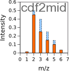

# cdf2mid 
Version: 1.0

## Short description
R-program to read CDF files, created by mass spectrometry machine, and evaluate the mass spectra of 13C-labeled metabolites 

## Description

CDF2MID is a computer program, written in R, designed to read the machine-generated files saved in netCDF format containing time courses of m/z spectra registered for various metabolites. It evaluates the peaks of mass isotopomer distribution (MID) of metabolites, thus preparing the data to further correction for natural isotope occurrence. The github repository "https://github.com/seliv55/cdf2mid" is used to create the docker image.

CDF2MID reads the CDF files presented in the working directory, finds the spectra corresponding to specific metabolites of interest; corrects baseline for each peak in the spectra; choses the time points where the distribution of peaks is less contaminated by other compounds and thus is the most representative of the real distribution of mass isotopomers in the analyzed metabolite; evaluates this distribution, and saves it in files readable by MIDcor, a program, which performs the next step of analysis, i.e. correction of the CDF2MID spectra for natural isotope occurrence, which is necessary to perform a further spep, fluxomic analysis that reveals the distribution of metabolic fluxes in the studied cells that corresponds to the evaluated distribution of artificially introduced 13C isotopes. 

The functions performed by CDF2MID are similar to those of RaMID (https://github.com/seliv55/ramid), however there is a difference in the input data for both programs. Ramid uses the description of metabolites of interest provided in the format of table exchangeable with the database Metabolights, therefore it designed for primary analysis of mass spectra already presented in this database. A table in such a format is dificult to to provide manually, it is supposed that it is downloaded from the database. CDF2MID is designed for the primary anlysis of recently obtained data that are not uploaded to Metabolights yet. In addition to the analysis of data CDF2MID provides them in the format of table exchangeable with Metabolights, thus preparing them for uploading. The difference in the format of input data description determines also an essential difference in the code. Input tables for RaMID provide direct link between each measurement for a given metabolite and a corresponding CDF file. The input information for CDF2MID does not contain such a link. This simplify the data description for the user, but makes the code more complicated: it searches the desired spectra one by one through all the provided CDF files.


## Key features

- Primary processing of 13C mass isotopomer data obtained with GCMS: evaluation of mass spectra for the metabolites of interest.

## Functionality

- Workflows
- Data Management

## Approaches

- Isotopic Labeling Analysis / 13C
    
## Instrument Data Types

- MS
- GC-MS

## Tool Authors

- [Vitaly Selivanov](https://github.com/seliv55) (Universitat de Barcelona)

## Container Contributors

- [Vitaly Selivanov](https://github.com/seliv55) (Universitat de Barcelona)
- [Pablo Moreno](https://github.com/pcm32) (EMBL-EBI) 

## Website

- https://github.com/seliv55/cdf2mid

## Git Repository

- https://github.com/seliv55/cdf2mid

## Installation

cdf2mid is present on all PhenoMeNal Galaxy instances on deployed Cloud Research Environments, under the Fluxomics category in the tool bar to the left of the screen. No installation is needed hence on PhenoMeNal Cloud Research Environments.

For advanced Docker usage:

- Go to the directory where the dockerfile is.
- Create container from dockerfile:

```
docker build -t cdf2mid .
```

Alternatively, pull from repo:

```
docker pull container-registry.phenomenal-h2020.eu/phnmnl/cdf2mid
```

## Usage Instructions

On a PhenoMeNal Cloud Research Environment, go to Fluxomics tool category, and then click on cdf2mid, and fill the expected input files, then press Run. Additionally, the tool can be used as part of a workflow with Midcor, Iso2flux and the Escher-Fluxomics tools. On a PhenoMeNal deployed CRE you should find as well a Fluxomics Stationary workflow, which includes cdf2mid. 

- To run cdf2mid as a docker image created in the PhenoMeNal repository, execute
 
```
docker run -it -v $PWD:/data container-registry.phenomenal-h2020.eu/phnmnl/cdf2mid -i /data/metdata -o /data/cdf2midout.csv -z /data/wd
```
- To run cdf2mid as a docker image created locally:

```
docker run -it -v $PWD:/data cdf2mid -i /data/metdata -z /data/wd/ -o /data/cdf2midout.csv
```
The working directory could be any directory in the used computer, it is named for the docker image as "/data". It should contain: i) an input data description (in the presented example in the file "metdata"), and ii) a directory containing CDF file (here "/wd"). The output is provided as CSV table in the format exchangeable with Metabolights. It can have any name, here it is named "cdf2midout.csv". Whereas the output file is generated automatically and do not require any specific explanation, the first and the last parameters, the format of input data description (here "metdata") and the convention for CDF file names do require explanations, although thes formats made maximally simple for the data provider. They are described below.

- run test1 using the test data (available for reference in [this Google Drive folder](https://drive.google.com/drive/folders/17dBkItF19KjT4b_3-9j6yGMJVcQIWonJ)).
 
```
docker run -it --entrypoint=runTest1.sh cdf2mid:0.1 
```
The format of input data description. The input data description file (here "metdata") contains the additional information prepared by the data provider that is necessary for the analysis and for the output table to write in the format accepted as exchangeable with the Metabolights database. It should contain four main parts: (i) list of metabolites of interest, which spectra should be extracted from the provided CDF files, (ii) list of substrates with artificially introduced tracers (13C atoms), which were used to label intracellular metabolites in the given series of experiments, (iii) list of timepoints during cells incubation, where the measurements of labeling were performed, (iv) list of conditions (cell types) whose data are presented in the CDF files, but which should be analyzed separately.

These parts are labeled by the keywords: "metabs", "tracer", "inctime", "cells". These keywords should not be changed, az well as the words list(), c().

For more details, see the documentation when clicking on the cdf2mid tool in Galaxy on a PhenoMeNal CRE (such as https://public.phenomenal-h2020.eu/)

## Publications

